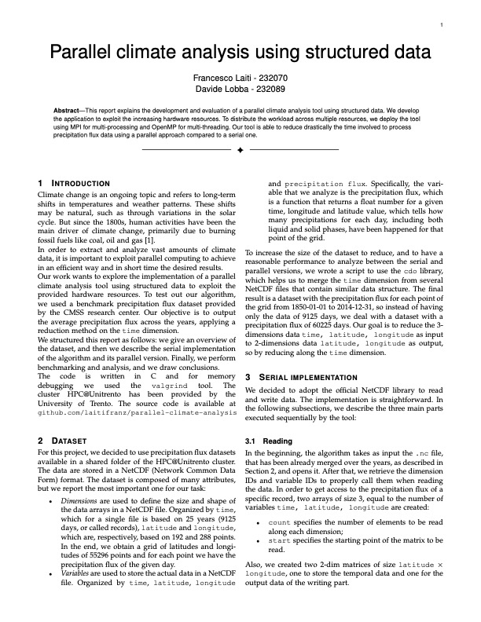
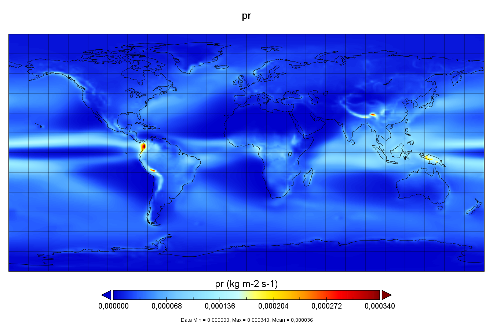
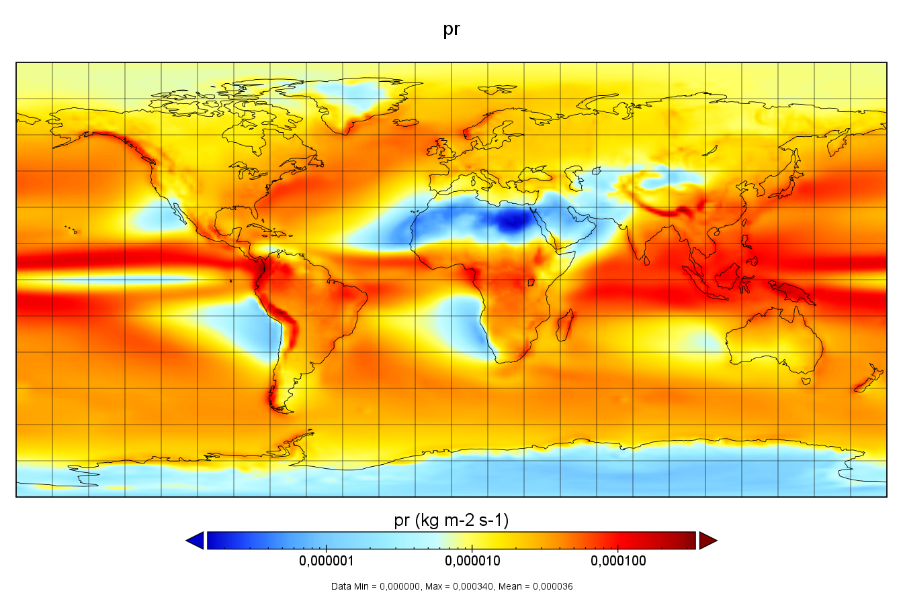

<div align="center">
  <h1 align="center">:mag: Parallel climate analysis using structured data</h1>
  <p align="center"> 
  </p>
</div>

<div align="center">
    <a href=#report-and-presentation>Report & presentation</a>
    •
    <a href=#build-and-run>Build & run</a>
    •
    <a href=#job-configurations>Job configurations</a>
    •
    <a href=#dataset>Dataset</a>
    •
    <a href=#final-results >Final results</a>
</div>
<br>

This repository contains the High Performance Computing for Data Science project for the academic year 2022/2023.

With this work, we deliver a parallel climate analysis tool using structured data. We develop the application to exploit the increasing hardware resources. To distribute the workload across multiple resources, we deploy the tool using MPI for multi-processing and OpenMP for multi-threading. Our tool is able to reduce drastically the time involved to process precipitation flux data using a parallel approach compared to a serial one.

---
## Report and presentation
| <b>Report</b> | <b>Presentation</b> |
|--------------------------------------------------------------------------------------------------------------------------|---------------------------------------------------------------------------------------------------------------------------------|
| [](report.pdf)              | [](presentation.pdf)         |

## Build and run
Clone the repository

   ```sh
   git clone https://github.com/laitifranz/parallel-climate-analysis.git
   ```
Move to the desired implementation

   ```sh
   # serial version
   cd serial/
   # parallel versions
   cd parallel/MPI_openMP/
   cd parallel/dask/
   ```
   > Dask is an experimental Jupyter version. It has not been tested, only implemented

Build and launch the jobs
  ```sh
   bash launch.sh
   ```

## Job configurations
Every ```launch.sh``` build first the project, then submit several jobs to the cluster with different configurations. The job can be setup using different parameters:

- ```PROBLEM_SIZE```: Size of the problem. Three option are set by default: 0.25, 0.5, 1 (original size problem);
- ```PROCESSES```: Number of processes to be used;
- ```THREADS```: This variable determines the number of threads to be used by each process;
- ```RUN```: Run number for each configuration. We decided to run the same configuration 3 times in order to avoid I/O unpredictable behaviours;
- ```NUM_NODES```: Number of nodes requested to the cluster. By default is set to 4;
- ```PLACE```: PBS placing strategy. By default is set to ```scatter:excl```.

## Dataset
For this project, we decided to use precipitation flux datasets available in a shared folder of the HPC@Unitrento cluster. The data are stored in a NetCDF (Network Common Data Form) format.

In addition, in order to obtain more consistent results, given the fact that a single NetCDF file was made by only 25 years of recording, we decided to augment the dataset exploiting the CDO library. In the end, we obtained a dataset of 165 years of recording.
The notebook [```merge_datasets.ipynb```](utils/merge_datasets.ipynb) provides a script to merge multiple datasets into one.

## Final results
Mean precipitation flux from 1850-01-01 to 2014-12-31 (60225 days). 
| Standard scale | Logarithmic scale |
|--------------------------------------------------------------------------------------------------------------------------|---------------------------------------------------------------------------------------------------------------------------------|
| [](assets/precipitation_flux.png)              | [](assets/precipitation_flux_logarithmic_scale.png)         |

> Displayed using Panoply data viewer from NASA.
